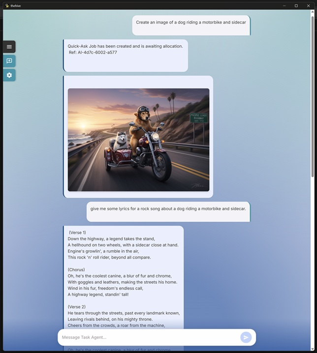

# The Hive : AI Assistants For All
### By Botzy Bee

>
> **NOTE : 'The Hive' is still work-in-progress and is not production-ready. GNU v3 Licence.**
>

The Hive is an Agentic AI workspace that allows users to use several different AI models to power custom agents. The Hive focuses on handling context locally on your computer and only passing data to AI models when needed. It's built to be multi-modal - it can read and write files, call tools, search online, as well as create images and work with audio. 

The Hive is built as a space for testing the capabilities of different LLM models, but also aims to become a useful personal AI-Assistant that can perform real-world tasks. 

### Frontend 🖥️
The Hive frontend is built using SvelteKit and Tauri - This allows the frontend to run both in your web browser and also as a stand-along application. 

### Backend ⚙️
The Hive backend is dockerised for easy deployment and management. It consists of two main docker containers which run on a shared docker network. 
- Express API Server - This is the main powerhouse behind The Hive. It hosts the agents, tools and functions needed to complete the users tasks. 
- Surreal DB Instance - This is used for maintaining an index of the agent's 'UserFiles' folder and also details of the available tools and guides. 

### Tools 🔨
Each agent has access to the following tools:
 - aiTextAction : General purpose AI text tool. For example for generation, reviewing, summerising etc. 
 - readFile : For reading files on the user's computer (The user sets the AI's 'home' folder.)
 - writeFile : For writing data, image, audio files to the user's computer.
 - getContentsOfDirectory : Get the contents of a folder/ directory.
 - findFileOrFolder : Helps agents find files that the user want to work with. 
 - aiWebSearch : Uses AI to perform online/ web searching. 
 - aiImageTool : For creating / modifying images or creating graphics etc. 
 - textToSpeech : Turns text into audio (speech)
 - createCodeTool : Used for creating code or reviewing code. 
 - calculator : For doing tough sums like 2+2
 - findAndReplaceTextTool : for simple find and replace actions on blocks of text. 
 - timeAndDateTool : Returns the current time / date. 
 - textCombiner : Allows the agent to combine blocks of text without passing them through the LLM (saves context / tokens)
 - superEditor : Performs edits on files using diffs (can edit large files - saves context / tokens)
 - createMermaidDiagram : Create mermaid code for creating diagrams such as flow charts. 
 - deepResearchTool : Performs deep research on the user topic. Includes fact-checking. 
 - (More coming soon...)

### LLM Providers 🤖
The Hive is currently setup to use any of the following LLM providers (mix n match!)
- Gemini (Text, Image, Audio, Code, WebSearch)
- OpenAI (Text, Code)
- Perplexity (Text, WebSearch)
- Anthropic (Text, Code)

### SETUP
Setup guides will be added to Frontend and Backend folders in due course 🐝